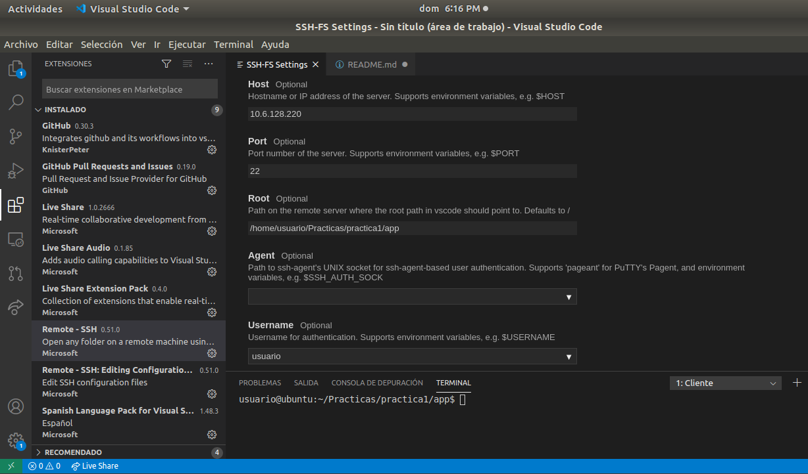
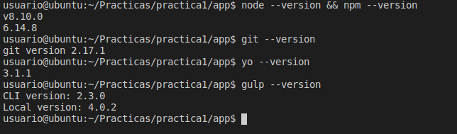
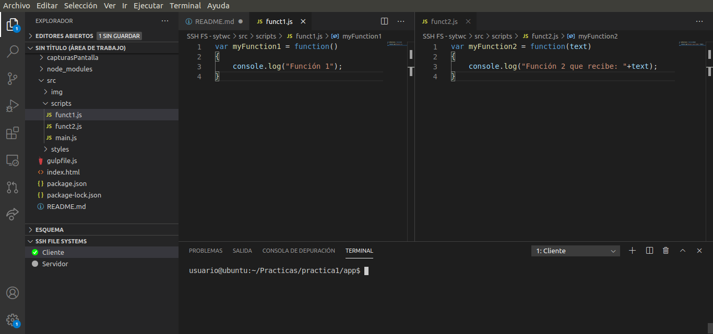

# **Práctica 1**
## Configuración de máquina

### 1. Verificando la instalación de los componentes necesarios

Para el desarrollo de las actividades, se utilizará VisualStudio Code con la extensión **"Remote SSH"** para conectasrde directamente a la máquina virtual del Iaas y trabajar desde allí.



Componentes instalados:



### 2. Inicializando proyecto

El proyecto inicialmente se nombró como: **"practica1_configuracion_maquina_virtual"** pero debido a que el nombre en ruta era muy largo se cambió por: **"app"**

#### Iniciando el proyecto básico:

```
$ yo learnfe
```


#### Git

El repositorió fue clonado desde GitHub y se trabajó en el directamente. Para ver el último commit se creó un **"Git aliases"**

```
git config --global alias.last 'log -1 HEAD'
```


#### Inicializado NPM


#### Gulp

Para la automatización de tareas agregaremos el paquete **concat** la cual nos permitirá combinar archvios **.js** y **.css**. El objetivo de esto será juntar dos archivos **.js** y alojarlos bajo un nombre en una ruta predeterminada

```
npm install --save-dev gulp-concat
```

Mientras que para la minificación de **.js** y **.css**, utilizaremos uglifly y minify respectivamente.

```
npm install --save-dev gulp-uglify
```

- gulpfile.js

Variables a utilizar:


La primer tarea llamada como **"minify-js*"** será la encargada de minificar los archivos **.js** de la ruta **src/scrips** y alojar el nuevo en la ruta **src/build/scripts**.


En este caso los dos archivos son **funct1.js** y **funct2.js**



Al ejecutar el comando:

```
gulp minify-js
```


La segunda tarea llamada **minify-css** será la encargada de minificar los archivos **.css** de la ruta **src/scrips** y alojar el nuevo en la ruta **src/build/styles**


Al ejecutar el comando:

```
gulp minify-css
```


- SourceMaps

Los source maps nos servirán para realizar un mapeo entre el código escrito y el transformado tanto para archivos **.js** y **.css**. Este mapa nos permitirá hacer una depuración donde podemos ver el código fuente de los archivos comprimidos, como si se tratase del archivo original

Para implementarlo, se debe de instalar el paquete necesario y añadir el **"sourcemaps"** dentro de las tareas del **gulpfile.js**

```
npm install --save-dev gulp-sourcemaps
```


Al ejecutar el comando:

```
gulp sourcemaps
```


#### Actualización navegador

Para la actualización automatica del navegador, cuando se realicen cambios en el código, necesitamos paquete **browser-sync**

```
npm install --save-dev browser-sync
```

Ejecutando la tarea 

```
gulp serve
```

Obtenemos la IP y vemos el estado actual de la página


Y una vez actualizado el archivo HTML, se actualiza automáticamente el navegador

